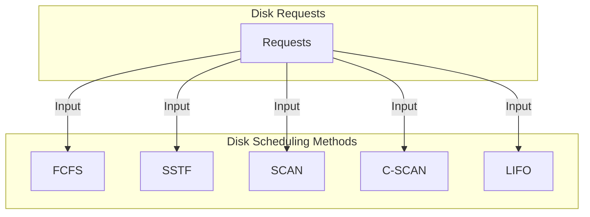

# Os-disk_scheduling_algorithms
Python GUI Disk Scheduling Application

**Key Terms in Disk Scheduling**

- **Seek Time:** Time to position the disk arm at the target track for data access.

- **Rotational Latency:** Time for the desired sector to rotate under the read/write heads.

- **Transfer Time:** Time to read/write data, influenced by disk speed and data size.

- **Disk Access Time:** Total time for a disk I/O operation, including seek, rotation, and transfer times.

- **Disk Response Time:** Average wait time for I/O requests. 

- **Variance Response Time:** Measures variation in request servicing time. An efficient algorithm minimizes both response time and variance.

# Disk Scheduling Algorithms

This repository contains Python implementations of various disk scheduling algorithms. These algorithms are used to manage disk access requests in storage systems, maximizing efficiency and minimizing access time.

## Implemented Algorithms

1. **First Come First Served (FCFS)**
   - Description: This is the simplest disk scheduling algorithm. It serves requests in the order they arrive.
   

2. **Shortest Seek Time First (SSTF)**
   - Description: This algorithm seeks the request closest to the current read/write head position. It minimizes seek time.
  

3. **SCAN**
   - Description: The read/write head moves in one direction and serves requests as it advances. It then reverses direction when it reaches the disk's end.
   

4. **C-SCAN**
   - Description: Similar to SCAN, but always moves in the same direction. When it reaches the disk's end, it wraps around to the other end without serving requests on the way back.
   

5. **Last-In First-Out (LIFO)**
   - Description: This algorithm places requests in a stack and serves them in reverse order. Useful in applications where requests may arrive in groups.

   

